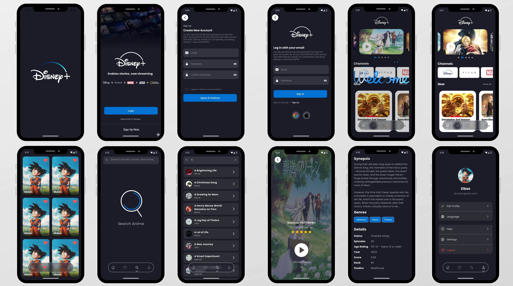

# Disney+ Clone App

<p align="center">
  
</p>

A feature-rich Disney+ clone application built with Flutter. This project showcases a modern, feature-driven architecture, a clean UI, and a robust technology stack to deliver a seamless user experience for browsing and discovering movie and anime content.
u
## 🌟 Features

-   **Splash & Onboarding:** Engaging animated splash screen and a welcoming onboarding experience for new users.
-   **User Authentication:** Secure login and registration functionality.
-   **Dynamic Home Page:** A well-organized home screen featuring:
    -   Carousel sliders for featured content.
    -   Categorized lists for different channels (Disney, Pixar, Marvel).
    -   Lists for trending, upcoming, and top-rated movies.
-   **Movie Details:** A comprehensive details screen for each movie/show, including synopsis, ratings, and video playback options.
-   **Search Functionality:** Easily search for content within the app.
-   **Favorites:** Ability to mark movies and shows as favorites for easy access.
-   **App Navigation:** Smooth and intuitive navigation between different sections of the app.

## 📂 Project Structure

The project is organized into a `lib` directory that follows a clean, feature-based structure.

```
lib/
├── app/                # Main application setup
├── core/               # Core functionalities shared across the app
│   ├── di/             # Dependency injection setup
│   ├── network/        # Networking layer (API services, models, Dio setup)
│   ├── routes/         # Navigation and routing
│   ├── strings/        # Constants for strings and assets
│   ├── themes/         # App-wide theme and styling
│   └── widgets/        # Common reusable widgets
└── features/           # Individual feature modules
    ├── auth/           # Authentication (Login, Register)
    ├── home/           # Home screen
    ├── anime_details/  # Details screen
    ├── search/         # Search feature
    ├── favorit/        # Favorites feature
    ├── on_boarding/    # Onboarding screens
    └── splash/         # Splash screen
```

## 🚀 Getting Started

Follow these instructions to get a copy of the project up and running on your local machine for development and testing purposes.

### Prerequisites

-   Flutter SDK (version 3.8.1 or higher)
-   Dart SDK
-   An IDE like Android Studio or VS Code

